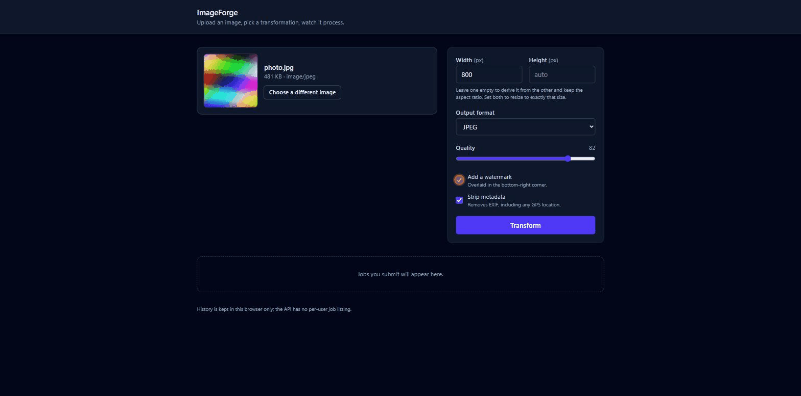
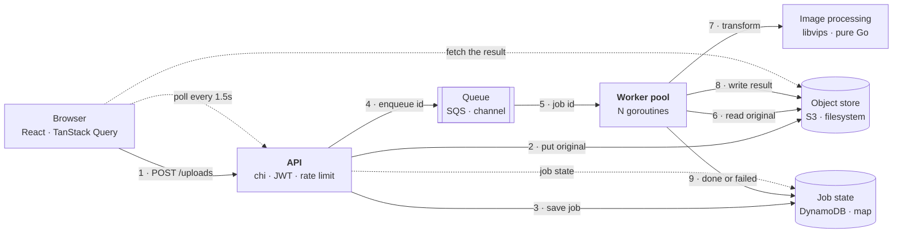
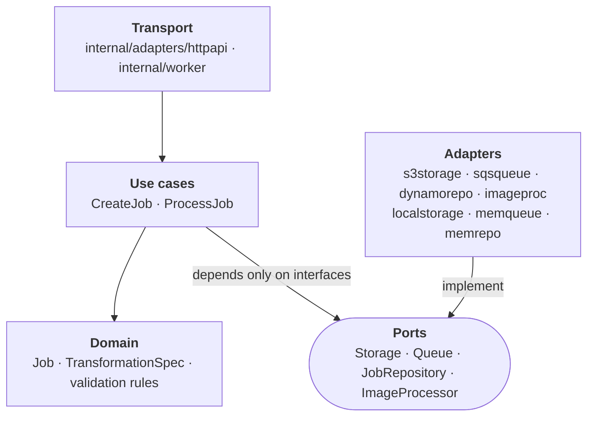

# ImageForge

[](https://github.com/aperskii/ImageForge/actions/workflows/ci.yml)
[](https://github.com/aperskii/ImageForge/actions/workflows/build-and-push.yml)
[](https://github.com/aperskii/ImageForge/actions/workflows/terraform.yml)
[](go.mod)


**An asynchronous image processing service in Go, built the way a production one
would be.** You upload an image and say what you want done to it; the API stores
the original, records a job and returns immediately. A pool of workers drains
the queue, transforms the image with libvips and writes the result back.
Everything is behind interfaces, so the same code runs on a filesystem and a Go
channel on a laptop, and on S3, SQS and DynamoDB in AWS — with a single
environment variable between the two. One `make dev` brings the whole thing up.



---

## Contents

- [How it works](#how-it-works) · [Tech stack](#tech-stack) · [Why I built this](#why-i-built-this-and-what-it-demonstrates)
- [Quick start](#quick-start) · [Performance](#performance) · [Tracing](#tracing-a-job-end-to-end)
- [API](#api) · [Authentication and limits](#authentication-and-limits) · [Worker](#worker)
- [Backends](#backends) · [Containers](#container-images) · [CI](#continuous-integration) · [Deployment](#deploying-to-aws)

## How it works



An upload is three writes and a return: the original goes to storage, the job to
the repository, its id to the queue. Nothing is transformed on the request path,
so a 40MP photo and a thumbnail take the same time to accept. A worker picks the
id up, does the work, and moves the job to `done` or `failed`; the browser finds
out by polling.

Every box on the right of that diagram is named twice because it is two
implementations of one interface. The arrows between the layers only ever point
one way:



`internal/domain` and `internal/usecase` import nothing but the standard library
and each other — no AWS SDK, no chi, no libvips. They talk to four interfaces,
and every piece of infrastructure is a struct in `internal/adapters` that
satisfies one of them. That is what lets the whole stack run on a laptop with no
cloud account, and it is checked rather than hoped for:

```sh
go list -deps ./internal/domain ./internal/usecase | grep -E 'aws|chi|vips'   # no output
```

## Tech stack

| Area | Choice | Why |
| --- | --- | --- |
| Language | Go 1.25 | Goroutines and channels are the whole worker pool; static binaries keep the images small |
| HTTP | [chi](https://github.com/go-chi/chi) | A router, not a framework: `http.Handler` all the way down |
| Images | [govips](https://github.com/davidbyttow/govips) / libvips | Far faster and lighter on memory than ImageMagick; a pure-Go fallback sits behind a build tag |
| Auth | [golang-jwt](https://github.com/golang-jwt/jwt) | HS256 with a pinned algorithm, checked issuer and required expiry |
| Storage | S3, or the filesystem | The same `Storage` port either way |
| Queue | SQS, or a buffered channel | Long polling, visibility timeouts, a dead-letter queue, explicit acknowledgement |
| Jobs | DynamoDB, or a map | On-demand billing suits a spiky, tiny-item workload |
| Metrics | [Prometheus](https://github.com/prometheus/client_golang) | Counters, a histogram and a gauge, on a listener of their own |
| Tracing | [OpenTelemetry](https://opentelemetry.io) | W3C trace context, propagated across SQS; Jaeger for a picture |
| Front-end | React 19, TypeScript, Vite, Tailwind 4, TanStack Query | Polling with `refetchInterval` is three lines rather than a reducer |
| Infrastructure | Terraform | Eight modules, least-privilege IAM, an environment that calls them |
| CI/CD | GitHub Actions | Lint, race tests, integration tests, images to ECR over OIDC |
| Local AWS | [LocalStack](https://localstack.cloud) | The AWS adapters are exercised for real, in CI as well as by hand |

## Why I built this, and what it demonstrates

I wanted one project covering the things a backend service actually has to get
right, rather than several that each show one. Everything below is something you
can go and read, not a claim.

**Concurrency.** [`internal/worker`](internal/worker/pool.go) is a fixed pool of
goroutines draining a channel, with the two hard parts done properly: graceful
shutdown, where in-flight jobs run on a context *detached* from the one being
cancelled — otherwise "wait for the work to finish" cancels it instead — and a
race-detector test that submits a hundred jobs from a hundred goroutines and
asserts every one reaches `done`.

**Clean architecture.** Ports and adapters, with the dependency rule enforced by
`go list -deps` rather than by good intentions. Swapping the entire persistence
layer is one environment variable, and the use case tests mock four interfaces
and touch nothing else. When SQS needed message deletion, the `Queue` port did
not change: `sqsqueue` grew an optional
[`ports.Acknowledger`](internal/ports/ports.go) that the pool type-asserts for
and works fine without.

**Observability.** Structured `log/slog` throughout, Prometheus metrics on a
separate port, and OpenTelemetry spans whose trace context rides the SQS message
attributes — so one trace id follows a job from the browser's request into a
worker in another container. Every log line carries that id, and
[grepping for it](#tracing-a-job-end-to-end) returns both halves of the job.

**Infrastructure as code.** [Terraform](deployments/terraform/) for the whole
deployment: S3 with lifecycle rules, SQS with a redrive policy, DynamoDB, ECR,
Fargate behind an ALB, CloudFront over an origin access control. The IAM is
scoped to what the code does rather than to what the services are — the API has
no `s3:GetObject`, because it never reads an object, and neither role can `Scan`.

**Security in the transport, not around it.** Bearer tokens with a pinned
signing algorithm, a per-client token bucket returning `429` with `Retry-After`,
RFC 7807 problem responses, and media types decided by **sniffing the bytes**
rather than believing the `Content-Type` header — a shell script called
`photo.png` gets a `415`.

**Operational detail.** Multi-stage builds producing a 23MB distroless API
image; a healthcheck that runs the binary itself, because distroless has no
curl; exponential backoff with full jitter, so workers that lost the queue
together do not come back in lockstep; and CI that runs the suite twice, once
with libvips and once in a job that deliberately does not install it.

## Quick start

One command brings up the whole stack — LocalStack, the API, the worker and the
front-end — with the AWS resources created before anything tries to use them:

```sh
make dev
```

Then open **http://localhost:5173**, drop in an image and press Transform.

| Service | Where | What it is |
| --- | --- | --- |
| web | http://localhost:5173 | The React app (Vite, hot reload) |
| api | http://localhost:8080 | The HTTP API |
| worker | http://localhost:9090/metrics | Prometheus metrics and health |
| localstack | http://localhost:4566 | S3, SQS and DynamoDB |
| jaeger | http://localhost:16686 | Traces, with `make dev-tracing` |

The first run builds two images and installs the front-end's dependencies, so it
takes a few minutes; later runs start in seconds.

```sh
make dev-logs      # follow every service
make dev-tracing   # the same stack, plus Jaeger, exporting spans to it
make dev-down      # stop everything and delete its data
```

Requirements: **Docker with Compose, and nothing else.** Go, Node and libvips
are only needed to work on the code outside containers — see
[Working on the code](#working-on-the-code).

### What `make dev` actually does

```
localstack ──healthy──▶ aws-init ──exits 0──▶ api ──healthy──▶ web
                                          └──▶ worker
```

`aws-init` creates the bucket, the queue, its dead-letter queue and the table,
then exits. The API and the worker wait for it to *finish*, not merely for
LocalStack to answer: a container reporting healthy says nothing about whether
the resources it holds exist yet. Every step of the script is idempotent, so a
restart costs nothing.

The front-end runs from a bind mount, so editing anything under `web/` reloads
in the browser without rebuilding an image. The Go services do not: change them
and run `make dev` again.

### Working on the code

Outside the containers you need Go 1.25+, Node 20+, `golangci-lint`, and libvips
8.10+ (`libvips-dev` on Debian/Ubuntu, `brew install vips` on macOS). To build
without libvips, see [Image processing backends](#image-processing-backends).

```sh
make aws-up       # just LocalStack, with its resources created
make run-api      # run the HTTP API from source
make run-worker   # run the worker from source
make build        # compile both binaries into ./bin
make test         # the test suite, with the race detector
make lint         # golangci-lint
make images       # build the two container images
```

## Performance

Measured with [`test/load/uploads.js`](test/load/uploads.js), a k6 script that
uploads a 480KB, 1600×1200 JPEG and asks for an 800px JPEG at quality 82. It
holds four concurrency levels for 30 seconds each, one after another, so every
level is measured on its own rather than smeared across a ramp.

```sh
IMAGEFORGE_RATE_LIMIT=5000 make dev     # the stack, with the limiter out of the way
make load-test                          # needs k6 on the host
```

**Setup.** Docker Desktop on an AMD Ryzen 7 5700X (8 cores, 16 threads), 8GB
allocated to the Docker VM. One API container; **one worker container with a
pool of 4** (`IMAGEFORGE_WORKERS=4`); LocalStack standing in for S3, SQS and
DynamoDB. Load generated from a container on the same Docker network. Every
service, the load generator and the storage share one machine, so these are
relative figures rather than a capacity estimate for real AWS.

| Concurrent clients | Uploads accepted /s | Upload p95 | Upload median | End-to-end p95 |
| ---: | ---: | ---: | ---: | ---: |
| 5 | 32.0 | 83ms | 52ms | 3.3s |
| 10 | 36.9 | 103ms | 54ms | 6.1s |
| 20 | 39.5 | 196ms | 68ms | 12.2s |
| 40 | 47.7 | 435ms | 139ms | 22.8s |

4,686 uploads, **zero failed requests and zero failed jobs**. "Upload" is the
`POST /uploads` request — accepted, stored and queued. "End-to-end" runs from
that request to the job reaching `done`, sampled on one upload in twenty by
polling `GET /jobs/{id}` exactly as the front-end does.

The worker's own numbers over the same run:

```
imageforge_jobs_processed_total{status="processed"}   4687
imageforge_jobs_processed_total{status="failed"}         0
mean processing time                                   121ms
97% of jobs                                          < 250ms
```

**What the numbers say.** Four workers at ~121ms a job is a ceiling of about 33
jobs a second, and from ten clients upwards the API accepts uploads faster than
that. The excess does not fail and does not slow the API down: it goes into the
queue, which is what the queue is for, and comes back as end-to-end latency that
grows with the backlog while `POST /uploads` stays under half a second at eight
times the concurrency the pipeline can drain. That is the asynchronous design
doing its job, and it is visible as `imageforge_queue_depth` rising and then
draining back to zero.

The fix for the last column is not code, it is workers: processing is CPU-bound
and shares nothing between jobs, so it scales with pool size and then with task
count. `deployments/terraform` leaves that as `worker_desired_count`, with
autoscaling on the queue backlog noted as the obvious next step.

**One caveat, stated plainly.** The default rate limiter allows 5 requests a
second per client, far below what this generates, and the run above raised it.
Left at the default, the number being measured is the limiter rather than the
pipeline — so the script counts those `429`s separately, and a run that made
that mistake is obvious in the summary.

## Tracing a job end to end

A job is accepted by one process and finished by another, minutes later. What
ties them together is a trace id that travels with the message.

The API starts a span for the request; enqueueing injects the W3C trace context
into the SQS **message attributes**; the worker extracts it and starts its span
as a child. Both processes log through a `slog` handler that stamps `trace_id`,
`span_id` and `job_id` onto every record from its context. So one grep covers
both services:

```console
$ docker compose logs api worker | grep cf9521dd510341b2326da5efa586fb18
api    | {"msg":"accepted a job","job_id":"e1a9a0dc…","trace_id":"cf9521dd…","span_id":"fc310a2d…"}
api    | {"msg":"request completed","http":{"method":"POST","path":"/uploads","status":202},"trace_id":"cf9521dd…"}
worker | {"msg":"job processed","worker":1,"job_id":"e1a9a0dc…","duration":181933660,"trace_id":"cf9521dd…","span_id":"fa22894e…"}
```

The trace id also comes back on every response as `X-Trace-Id`, and appears in
every RFC 7807 error body, so a user reporting a problem can quote the one
string that finds everything about it.

**Spans are always recorded, and exported only if you ask.** With no collector
configured the ids are still real and still in the log; setting
`OTEL_EXPORTER_OTLP_ENDPOINT` adds the export. `make dev-tracing` starts Jaeger
and points both services at it, which turns that same trace into:

```
POST /uploads                     imageforge-api
├── S3.PutObject                   originals/…
├── DynamoDB.PutItem               the job record
└── SQS.SendMessage                the id, with the trace attached
    └── job.process               imageforge-worker      ← another container
        ├── S3.GetObject
        ├── image.transform        the only CPU in the trace
        ├── S3.PutObject           results/…
        ├── DynamoDB.UpdateItem
        └── SQS.DeleteMessage
```

The AWS spans come from `otelaws` middleware installed once on the shared
config, so every S3, SQS and DynamoDB call is timed without a single call site
knowing about it. `internal/domain` and `internal/usecase` import none of this.

| Variable | Default | Purpose |
| --- | --- | --- |
| `OTEL_EXPORTER_OTLP_ENDPOINT` | unset | OTLP/HTTP collector; unset records without exporting |
| `OTEL_SERVICE_NAME` | per binary | Overrides the name a process reports itself under |
| `OTEL_TRACES_SAMPLER_ARG` | `1` | Sampling ratio; parent-based, so a job is never half sampled |
| `OTEL_SDK_DISABLED` | `false` | Turns tracing off entirely, log ids included |
| `IMAGEFORGE_ENV` | unset | Deployment name recorded on every span |

## API

Every route that touches a job needs a bearer token; see
[Authentication and limits](#authentication-and-limits).

| Method | Path | Purpose |
| --- | --- | --- |
| `POST` | `/auth/token` | Issue a bearer token (demo credential flow) |
| `POST` | `/uploads` | Multipart upload, returns `202` with the job |
| `GET` | `/jobs/{id}` | Job status, and the result URL once done |
| `GET` | `/healthz` | Liveness, no dependency checks |
| `GET` | `/readyz` | Readiness |

`POST /uploads` takes a `file` part carrying the image and a `spec` part
carrying the transformation as JSON:

```sh
curl -X POST http://localhost:8080/uploads \
  -H "Authorization: Bearer $TOKEN" \
  -F 'file=@photo.png' \
  -F 'spec={"width":320,"format":"webp","quality":80,"strip_metadata":true}'
```

```json
{
  "id": "0003fd2a28894230e91355084ed980ba",
  "status": "pending",
  "transformation": { "width": 320, "height": 0, "format": "webp", "quality": 80,
                      "watermark": false, "strip_metadata": true },
  "created_at": "2026-09-02T14:01:12.812Z",
  "updated_at": "2026-09-02T14:01:12.812Z"
}
```

Every request passes through request ID, a server span, structured `log/slog`
logging, panic recovery, a 10MB body limit and CORS. Job routes additionally
pass through bearer-token authentication and a per-client rate limiter.

### Configuration

`make run-api` needs no configuration; every setting has a working default.

| Variable | Default | Purpose |
| --- | --- | --- |
| `IMAGEFORGE_ADDR` | `:8080` | Listen address |
| `IMAGEFORGE_STORAGE_DIR` | `.data/storage` | Filesystem object store root |
| `IMAGEFORGE_PUBLIC_BASE_URL` | unset | Prefix for a finished job's result URL |
| `IMAGEFORGE_CORS_ORIGINS` | `*` | Comma-separated allowed origins |
| `IMAGEFORGE_MAX_UPLOAD_BYTES` | `10485760` | Request body limit |
| `IMAGEFORGE_QUEUE_BUFFER` | `1024` | In-memory queue depth |
| `IMAGEFORGE_LOG_LEVEL` | `INFO` | `DEBUG`, `INFO`, `WARN`, `ERROR` |

## Authentication and limits

`/uploads` and `/jobs/{id}` require a bearer token. `/healthz` and `/readyz` do
not: a load balancer cannot hold a credential, and a liveness probe that can
fail on authentication is worse than useless.

```sh
TOKEN=$(curl -s -X POST localhost:8080/auth/token \
  -H 'Content-Type: application/json' \
  -d '{"client_id":"demo"}' | jq -r .access_token)

curl -X POST localhost:8080/uploads -H "Authorization: Bearer $TOKEN" \
  -F 'file=@photo.png' -F 'spec={"width":320,"format":"webp","quality":80}'
```

**`/auth/token` is a demonstration credential flow, not an identity system.**
With no `IMAGEFORGE_CLIENT_SECRET` set it issues a token to whoever asks, and
says so in a startup warning. What it does do properly is the part that matters
for the middleware consuming those tokens: HS256 with a pinned algorithm, a
checked issuer, a required expiry, and a constant-time secret comparison.

There is no default signing key. With `IMAGEFORGE_JWT_KEY` unset the server
generates a random one per process, so tokens stop working across a restart — an
ephemeral key nobody knows is safer than a default key that ships in the source
and reaches production.

Requests are rate limited per authenticated client with a token bucket, keyed on
the token's subject rather than on an address or header a caller can change.
Over budget returns `429` with `Retry-After`. Idle buckets are evicted, since an
unbounded map keyed by client is itself a way to attack the server.

| Variable | Default | Purpose |
| --- | --- | --- |
| `IMAGEFORGE_JWT_KEY` | random | 32+ bytes, hex-encoded, for signing |
| `IMAGEFORGE_CLIENT_SECRET` | unset | Required from clients when set |
| `IMAGEFORGE_TOKEN_TTL` | `1h` | Token lifetime |
| `IMAGEFORGE_RATE_LIMIT` | `5` | Sustained requests per second per client |
| `IMAGEFORGE_RATE_BURST` | `20` | Back-to-back requests allowed |

### Errors

Every non-2xx response is an RFC 7807 problem detail, served as
`application/problem+json`:

```json
{
  "type": "https://imageforge.dev/problems/rate-limited",
  "title": "Too Many Requests",
  "status": 429,
  "detail": "This client is over its budget of 5 requests per second. Retry in 1 second(s).",
  "instance": "/uploads",
  "request_id": "…",
  "trace_id": "…",
  "retry_after": 1
}
```

`type` is the stable identifier to switch on; `title` and `detail` are prose and
may be reworded. `request_id`, `trace_id` and `retry_after` are extension
members: the first two also appear in the server log, so a screenshot from a
user is enough to find the request.

### Upload validation

An upload is checked before any work is queued: the body is capped at 10MB, and
the media type is decided by **sniffing the leading bytes**, not by the
`Content-Type` the client declares. A shell script named `photo.png` and
labelled `image/png` is still rejected with `415`. Accepted source types are
JPEG, PNG, WebP, GIF, AVIF and BMP.

## Worker

[`internal/worker`](internal/worker/pool.go) runs a fixed pool of goroutines,
each pulling job identifiers from the `Queue` and handing them to the
`ProcessJob` use case. It owns concurrency and lifecycle only; what processing a
job means stays in the use case.

On `SIGTERM` or `SIGINT` the pool stops taking new work and waits for what is in
flight, bounded by a timeout. Jobs already running are deliberately given a
context detached from the one being cancelled — otherwise "wait for in-flight
jobs" would abort them instead of letting them finish. If they outlast the
timeout they are cancelled and `Run` reports `ErrShutdownTimeout`.

A failing job is recorded against the job and counted; it never stops the pool.
A job that is no longer pending is skipped, which is the normal outcome of a
duplicate delivery from an at-least-once queue.

The in-memory queue lives inside one process, so a worker started on its own has
nothing to read and will idle. Pass image paths to submit jobs through the same
`CreateJob` use case the API uses, and watch the pipeline run end to end:

```sh
go run ./cmd/worker photo.png diagram.png
make run-worker                            # no arguments: idles until stopped
```

| Variable | Default | Purpose |
| --- | --- | --- |
| `IMAGEFORGE_WORKERS` | `4` | Pool size |
| `IMAGEFORGE_SHUTDOWN_TIMEOUT` | `30s` | Bound on draining in-flight jobs |
| `IMAGEFORGE_JOB_TIMEOUT` | `2m` | Bound on a single job |
| `IMAGEFORGE_STORAGE_DIR` | `.data/storage` | Filesystem object store root |
| `IMAGEFORGE_WATERMARK_TEXT` | `ImageForge` | Watermark overlay text |
| `IMAGEFORGE_SEED_FORMAT` | `jpeg` | Output format for seeded jobs |
| `IMAGEFORGE_SEED_WIDTH` | `640` | Output width for seeded jobs |
| `IMAGEFORGE_SEED_QUALITY` | `80` | Output quality for seeded jobs |

### Metrics

The worker serves Prometheus metrics on its own listener, separate from any
application port so it can be firewalled off independently.

| Metric | Type | Labels |
| --- | --- | --- |
| `imageforge_jobs_processed_total` | counter | `status` |
| `imageforge_processing_duration_seconds` | histogram | `status` |
| `imageforge_queue_depth` | gauge | — |
| `imageforge_queue_receive_errors_total` | counter | — |

`status` is `processed`, `failed` or `skipped`. All three are published at zero
from startup, so an alert on `rate(...)` is evaluable before the first failure
rather than silently matching nothing. The duration buckets span 10ms to 60s,
which is the range image work actually covers.

`queue_depth` is refreshed on a timer from the queue itself, and is advisory:
SQS reports an approximation, and it is stale by the time it is read.

### Reading from the queue

A failed receive is retried with exponential backoff and full jitter: the delay
doubles per consecutive failure up to a ceiling, and the actual wait is drawn
from `[0, delay)` so a fleet of workers that lost the queue together does not
come back in lockstep and stampede it. One success resets the sequence. The
consumer never gives up, because a queue coming back should find a worker still
waiting for it.

| Variable | Default | Purpose |
| --- | --- | --- |
| `IMAGEFORGE_METRICS_ADDR` | `:9090` | Metrics listener |
| `IMAGEFORGE_QUEUE_DEPTH_INTERVAL` | `15s` | How often the gauge is refreshed |

## Backends

`IMAGEFORGE_BACKEND` selects which adapters the binaries wire up. Both satisfy
the same ports, so nothing above `internal/adapters` changes with the choice.

| Backend | Storage | Queue | Jobs |
| --- | --- | --- | --- |
| `memory` (default) | filesystem | in-memory chan | in-memory |
| `aws` | S3 | SQS | DynamoDB |

The AWS backend talks to LocalStack when `AWS_ENDPOINT_URL` is set, and to real
AWS when it is not; nothing else differs.

```sh
make aws-up                          # start LocalStack and create the resources
export IMAGEFORGE_BACKEND=aws
export AWS_ENDPOINT_URL=http://localhost:4566
export AWS_REGION=eu-west-1
export AWS_ACCESS_KEY_ID=test AWS_SECRET_ACCESS_KEY=test
make run-api                         # one terminal
make run-worker                      # another
```

| Variable | Default | Purpose |
| --- | --- | --- |
| `IMAGEFORGE_BACKEND` | `memory` | `memory` or `aws` |
| `AWS_ENDPOINT_URL` | unset | Endpoint override for LocalStack |
| `AWS_REGION` | `eu-west-1` | AWS region |
| `IMAGEFORGE_S3_BUCKET` | `imageforge-media` | Bucket for originals and results |
| `IMAGEFORGE_SQS_QUEUE` | `imageforge-jobs` | Job queue name |
| `IMAGEFORGE_DYNAMODB_TABLE` | `imageforge-jobs` | Job state table |

### Local AWS resources

`deployments/docker/localstack-init.sh` creates the bucket, the queue, its
dead-letter queue and the table. LocalStack runs it on startup — docker-compose
mounts it into `/etc/localstack/init/ready.d` — and `make aws-init` runs it by
hand. Every step is idempotent.

The queue carries a redrive policy, so a message that fails five times moves to
`imageforge-jobs-dlq` instead of cycling forever. Deliveries are settled
explicitly: the worker deletes a message once its job is done and returns it to
the queue otherwise, through the optional `ports.Acknowledger` interface that
`sqsqueue` implements and `memqueue` does not.

### Integration tests

`test/integration` runs the API and the worker against LocalStack and checks the
whole upload → process → result flow. It is behind the `integration` build tag,
and skips itself when no stack is reachable.

```sh
make aws-up
make test-integration
```

## Image processing backends

`internal/adapters/imageproc` implements the `ImageProcessor` port twice, with
one shared `Process` pipeline. The backend is chosen at compile time:

| Build | Backend | Reads | Writes |
| --- | --- | --- | --- |
| default | govips | everything libvips can | jpeg, png, webp, avif |
| `-tags nogovips` | pure Go | jpeg, png, gif, webp | jpeg, png |

The default backend binds libvips through cgo and is what production runs. The
`nogovips` build uses only `image/draw` and `golang.org/x/image`, so it needs no
system libraries and no cgo — useful on machines without libvips and for
cross-compilation. It cannot encode WebP or AVIF (no pure-Go encoder exists) and
returns `ErrUnsupportedFormat` if asked to.

```sh
go build ./...                      # govips, needs libvips + cgo
go build -tags nogovips ./...       # pure Go, no system dependencies
make test TEST_FLAGS='-tags nogovips -count=1'
```

## Container images

Two images, built by `deployments/docker/*.Dockerfile` from the repository root.
They differ because the binaries differ.

| Image | Base | cgo | Size |
| --- | --- | --- | --- |
| api | `distroless/static` | no | ~23MB |
| worker | `debian:bookworm-slim` | yes | ~356MB |

`cmd/api` never reaches `internal/adapters/imageproc`, so it needs neither cgo
nor libvips and ships as a single static binary on a base with no shell and no
package manager — nothing for an attacker who finds a way to execute to run.
Keeping that true is worth something, so the API deliberately does not import
the image code.

The worker cannot be static: govips binds libvips through cgo. Its build stage
installs `libvips-dev` for the headers and the runtime stage installs
`libvips42` for the shared library alone, which leaves the compiler, the headers
and the Go toolchain out of the shipped image.

Both run as an unprivileged user (uid 65532) and both carry a `HEALTHCHECK` that
invokes the binary itself:

```sh
docker run --rm imageforge-api:latest healthcheck
```

That subcommand exists because the API image has no curl and no shell to probe
with, and adding one to a production image so a healthcheck can run would be a
poor trade.

## Continuous integration

Three workflows, in `.github/workflows/`.

| Workflow | Trigger | What it does |
| --- | --- | --- |
| `ci.yml` | every pull request | lint, `go test -race` on both backends, the integration suite against LocalStack, and the front-end build |
| `build-and-push.yml` | merge to the default branch | builds both images and pushes them to ECR |
| `terraform.yml` | pull requests touching `deployments/terraform`, plus manual dispatch | `fmt`, `validate`, `plan` as a PR comment; `apply` only by hand |

`ci.yml` runs the Go suite twice, once with libvips and once with `-tags
nogovips` in a job that deliberately does not install it. The fallback backend
exists for environments without libvips, so it is tested in one.

**Nothing stores an AWS key.** Both AWS-touching workflows authenticate over
OIDC: GitHub mints a short-lived token for the run and AWS trades it for
temporary credentials. `deployments/terraform/modules/github-oidc` creates the
three roles, each trusting a different subject:

| Role | Trusted subject | Power |
| --- | --- | --- |
| push | `ref:refs/heads/<default branch>` | write to these ECR repositories |
| plan | `pull_request` and the default branch | read-only |
| apply | `environment:dev` | change infrastructure |

The apply role trusts a GitHub *environment* rather than a branch, which is what
makes an approval rule on that environment load-bearing: without the approval,
GitHub never mints a token with that subject, so the role cannot be assumed at
all. Applying infrastructure is never something a merge does on its own.

Apply the Terraform with your repository named, then copy the outputs into
repository variables under **Settings → Secrets and variables → Actions**:

```sh
terraform -chdir=deployments/terraform/environments/dev apply \
  -var github_owner=aperskii -var github_repository=ImageForge

terraform -chdir=deployments/terraform/environments/dev \
  output -json github_actions_variables
```

The workflows skip themselves when those variables are absent, so a fork or a
fresh clone gets a clean skip rather than a confusing credentials error.

## Deploying to AWS

[`deployments/terraform`](deployments/terraform/) holds eight modules and an
environment that calls them: S3 with lifecycle rules, SQS with a dead-letter
queue and a redrive policy, DynamoDB on demand, ECR, a VPC, ECS Fargate behind
an Application Load Balancer, CloudFront over an origin access control, and the
GitHub OIDC roles above.

```sh
cd deployments/terraform/environments/dev
terraform init
terraform plan -out=tfplan     # worth reading: the first apply creates ~60 resources
terraform apply tfplan
```

[`deployments/terraform/README.md`](deployments/terraform/README.md) covers what
each module builds, how the IAM is scoped, and an itemized cost estimate for a
low-traffic dev deployment — about **$45 a month**, dominated by two Fargate
tasks and an ALB that bill for existing rather than for working.

## Layout

```
cmd/api                  HTTP API entrypoint
cmd/worker               Async processing worker entrypoint
internal/domain          Entities and value objects
internal/usecase         Application business rules
internal/ports           Interfaces consumed by the use cases
internal/worker          Goroutine pool draining the job queue
internal/telemetry       Tracing setup, trace propagation, the slog bridge
internal/metrics         Prometheus collectors and the /metrics endpoint
internal/healthcheck     The self-probing healthcheck subcommand
internal/adapters        Infrastructure implementations of the ports
  awscfg                 AWS client construction from the environment
  s3storage              Storage on S3
  sqsqueue               Queue on SQS (long polling, delete-on-success)
  dynamorepo             JobRepository on DynamoDB
  httpapi                HTTP transport (chi router, middleware)
  localstorage           Filesystem-backed Storage
  memqueue               In-memory Queue
  memrepo                In-memory JobRepository
  imageproc              Image processing (govips, or pure Go via -tags nogovips)
web/                     Vite + React front-end (see web/README.md)
deployments/terraform    Infrastructure as code
deployments/docker       Container build files
test/integration         End-to-end tests against LocalStack
test/load                The k6 load test and its fixture
.github/workflows        CI pipelines
```

## Status

Work in progress, in the sense that it is a portfolio project rather than a
service anyone runs. What is here works end to end: the API, the worker, the
front-end and both backends, containerized behind one `make dev`, traced across
processes, load tested, deployable by Terraform, and built and pushed by CI.

Known gaps, listed rather than left to be discovered: the buckets are
provisioned separately but the application still writes originals and results
into one of them (see the Terraform README); there is no TLS or domain on the
load balancer; task counts are fixed rather than autoscaled on queue depth; and
the front-end is a dev server in compose rather than a static build behind a
CDN.
